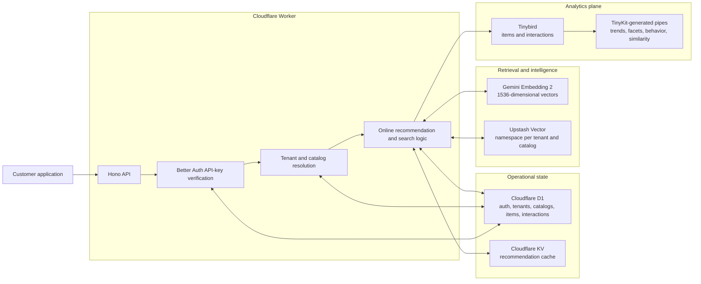
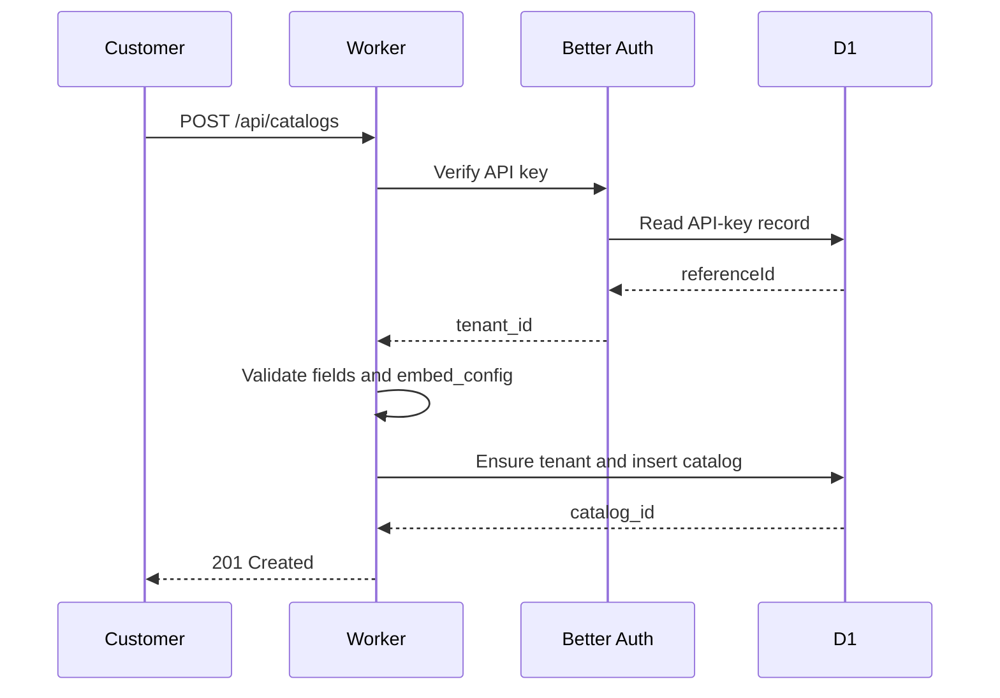
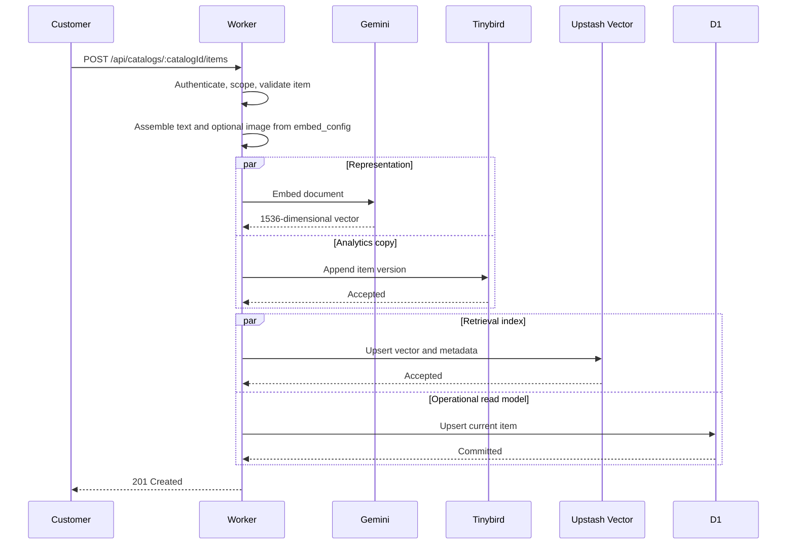
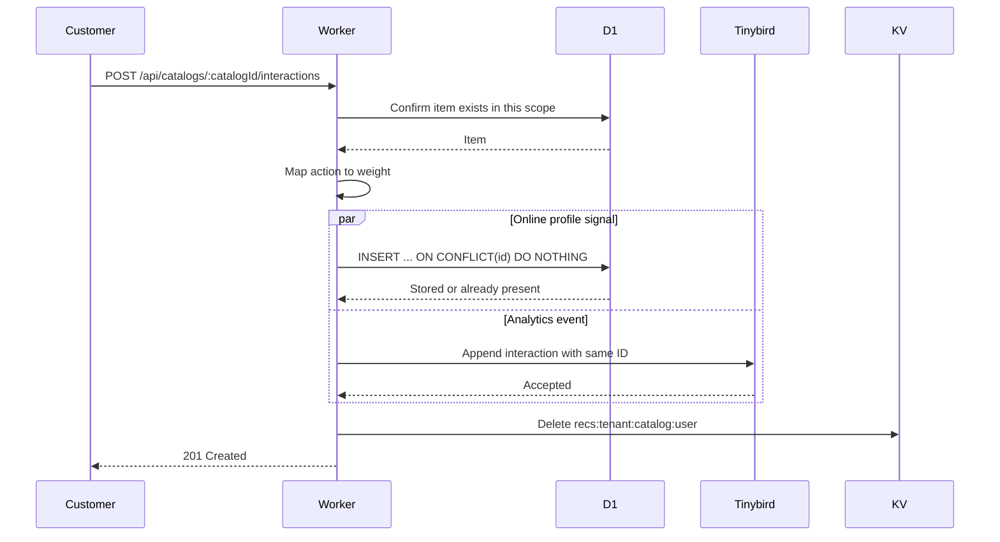
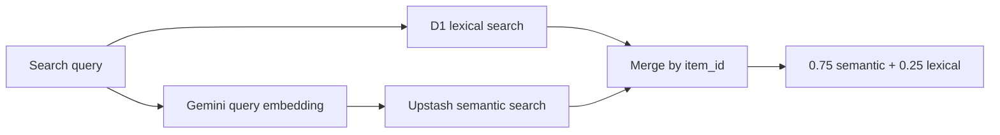

# Lumin Engine system design

Status: current implementation<br>
Runtime: Cloudflare Workers<br>
Primary API: `/api/catalogs/**`

## 1. System boundary

Lumin is a multi-tenant recommendation service. A product sends Lumin:

- a catalog definition;
- items belonging to that catalog;
- opaque user interaction events;
- search and recommendation requests.

Lumin owns the machinery between those inputs and a ranked response:

- catalog validation;
- text and image-aware embedding;
- vector indexing;
- user preference aggregation;
- candidate retrieval;
- cold-start fallback;
- hybrid search;
- recommendation caching;
- behavior analytics.

Lumin does not own a customer's source-of-truth product database, user
accounts, checkout flow, or presentation layer. It stores the minimum identity
needed for personalization: the tenant, catalog, caller-provided user ID,
interaction ID, item ID, action, and optional interaction metadata.

The product boundary is therefore:

```text
Customer product                         Lumin
─────────────────────────────────────────────────────────────────
Owns users and product data              Owns recommendation state
Chooses what an interaction means        Maps actions to weights
Renders search and recommendations       Returns ranked item metadata
Controls consent and retention           Isolates tenants and catalogs
```

## 2. Design requirements

### Functional requirements

1. Register domain-specific catalogs at runtime without deploying Lumin.
2. Ingest and update items with arbitrary validated attributes.
3. Support text-only and image-aware semantic representations.
4. Record positive and negative behavioral signals idempotently.
5. Serve personalized results for known users.
6. Serve a sensible popularity fallback for cold users.
7. Search newly written and semantically related items.
8. Produce catalog-scoped real-time analytics.

### Non-functional requirements

1. A tenant must never read another tenant's catalog.
2. A catalog must be usable immediately after registration.
3. The online recommendation path must not depend on the analytics system.
4. Duplicate interaction delivery must not amplify the online user profile.
5. A failed image download must not prevent text-based indexing.
6. The request layer must remain stateless enough to scale with Worker
   isolates.
7. Search should preserve practical read-after-write behavior even when the
   vector index is briefly behind.

## 3. High-level architecture



The architecture separates three kinds of work:

1. **Control plane:** API keys, tenants, catalog definitions, and field
   validation.
2. **Online serving plane:** item reads, interactions, search, preference
   vectors, recommendation retrieval, and cache access.
3. **Analytics plane:** append-oriented item and interaction history queried
   through Tinybird pipes.

Tinybird does not sit on the request-critical recommendation path. A Tinybird
query outage should not make an already indexed catalog impossible to
recommend from. The current write path still dual-writes to Tinybird
synchronously, which is discussed under failure handling.

## 4. Request isolation

Every protected catalog request passes through the same middleware chain:

```text
requireApiKey
  -> resolveTenant
  -> requireCatalog
  -> route handler
```

### API key to tenant

Better Auth verifies `X-App-Key`, `X-Api-Key`, or a bearer token. The API-key
record's `referenceId` becomes Lumin's `tenant_id`.

This makes an API key an authorization boundary, not just an authentication
credential. Callers do not submit a trusted `tenant_id` in request bodies.

### Tenant to catalog

Catalog lookup always includes both:

```sql
WHERE id = ? AND tenant_id = ?
```

If the catalog does not exist or belongs to another tenant, Lumin returns
`404`. Returning `404` instead of `403` avoids confirming the existence of
another tenant's catalog.

### Structural vector isolation

Every Upstash operation uses:

```text
namespace = tenant_id:catalog_id
```

This prevents a forgotten metadata predicate from turning into a cross-tenant
vector query. Isolation is encoded in the storage address itself.

### Analytics isolation

Every Tinybird datasource row carries `tenant_id` and `catalog_id`. Both fields
lead datasource sorting keys, and every generated pipe requires them as
parameters before applying user, time, category, or facet filters.

## 5. Domain-agnostic catalog model

Tinybird datasources are statically typed, while Lumin catalogs must be
registered at runtime. Creating one physical datasource per customer would put
a Tinybird deployment in the signup path.

Lumin therefore uses a universal item core:

```text
item_id
title
description
tags
category
image_url
price
attributes
```

Fields common to online ranking remain typed columns. Domain-specific fields
such as `author`, `brand`, `event_date`, `runtime`, `location`, or `mood` live
inside `attributes`.

At catalog registration, the tenant declares:

```json
{
  "name": "books",
  "fields": [
    { "name": "author", "type": "string" },
    { "name": "themes", "type": "string[]" }
  ],
  "embed_config": {
    "text_fields": ["title", "description", "author", "themes"],
    "image_field": "image_url"
  }
}
```

The declaration has two jobs:

1. Validate every attribute written to the catalog.
2. Decide what information shapes semantic similarity.

Unknown attributes and values with the wrong declared type are rejected. This
allows the storage model to stay generic without making input completely
unstructured.

## 6. Data ownership

| Store | Role | Authoritative for | Access pattern |
| --- | --- | --- | --- |
| D1 | Operational system of record | Auth, tenant ownership, catalog definitions, current item read model, online interaction history | Point reads, scoped lists, interaction scans |
| Upstash Vector | Derived retrieval index | Item vectors and recommendation metadata | Namespace fetch, upsert, nearest-neighbor query |
| Tinybird | Append-oriented analytics plane | Historical item and interaction events for analytical queries | Ingest API and catalog-scoped pipes |
| Cloudflare KV | Derived cache | Materialized recommendation responses | Per-user get, put, and delete |
| Gemini | Stateless model dependency | No Lumin-owned persistent record | Document and query embedding |

The distinction between authoritative and derived state is important:

- D1 decides whether an item exists before an interaction is accepted.
- Upstash decides semantic neighbors, but its contents can be rebuilt from the
  catalog item read model by re-embedding.
- KV can be deleted without losing user behavior.
- Tinybird can replay analytics from an event log only if Lumin introduces a
  durable outbox. The current synchronous dual-write is not yet a complete
  replay strategy.

## 7. Catalog registration flow



Catalog registration writes only D1. There is no Tinybird or Upstash deploy,
which is what makes registration a runtime operation.

## 8. Item ingestion flow



### Embedding behavior

The catalog's `text_fields` are concatenated in declaration order. If an
`image_field` is configured, Lumin fetches the image with:

- a 5-second timeout;
- a 4 MiB maximum;
- JPEG, PNG, and WebP allow-listing.

An unavailable or invalid image degrades to text-only embedding. A complete
embedding failure produces a zero vector and fails item ingestion.

Gemini receives `RETRIEVAL_DOCUMENT` for items and
`RETRIEVAL_QUERY` for searches. Both use 1536 output dimensions so queries and
items occupy the same vector space.

### Update semantics

Item IDs are stable within a tenant and catalog:

```text
(tenant_id, catalog_id, item_id)
```

D1 and Upstash use upsert semantics. Tinybird remains append-oriented and
analytical pipes recover the latest item representation with `argMax` over
`updated_at`.

## 9. Interaction and learning flow



The caller may supply the public interaction ID. Lumin prefixes it with tenant
and catalog before storage:

```text
tenant_id:catalog_id:interaction_id
```

The D1 primary key prevents a repeated delivery from counting twice in the
online taste vector. Tinybird can receive the duplicate physical row, so its
analytical pipes group by interaction ID before aggregating.

The interaction response currently reports the action weight even when D1
ignored a duplicate. The online profile remains idempotent, but a future API
revision should report whether the interaction was newly applied.

## 10. Recommendation algorithm

The recommendation endpoint first checks:

```text
recs:{tenant_id}:{catalog_id}:{user_id}
```

On a cache miss, it reads the user's latest 200 interactions from D1.

### Action weights

| Action | Weight |
| --- | ---: |
| `complete` | 3.0 |
| `purchase` | 3.0 |
| `like` | 2.0 |
| `save` | 1.5 |
| `click` | 1.0 |
| `view` | 0.25 |
| `dismiss` | -1.0 |
| `dislike` | -2.0 |

### Preference vector

For interaction `i`:

```text
decayed_weight_i =
  action_weight_i * exp(-0.08 * age_in_days_i)
```

The user vector is:

```text
user_vector =
  normalize(sum(item_vector_i * decayed_weight_i))
```

Positive actions pull the user vector toward an item's semantic region.
Negative actions push it away. Exponential decay makes recent behavior more
influential without deleting older history.

### Personalized path

If the user vector is non-zero:

1. Query the catalog's Upstash namespace.
2. Retrieve between 20 and 100 candidates, based on the requested limit.
3. Remove every item the user has already interacted with.
4. Return the highest-scoring remaining items.

The returned score is vector similarity. It is not a calibrated probability
that the user will like the item.

### Cold-start path

If no usable user vector exists, Lumin computes popularity in D1:

```text
popularity(item) = sum(interaction weights for item)
```

Items are ordered by weighted popularity and then recency. This keeps the same
endpoint useful before personalization has enough signal.

### Current model limitation

The user has one aggregate vector. If a person likes several distant interests,
for example family animation, horror, and science fiction, averaging them can
create a centroid that represents none of those interests cleanly.

A later ranking model should retain multiple interest vectors or session-level
intent rather than treating taste as one point.

## 11. Hybrid search

Search deliberately uses two retrieval paths:



### Lexical path

D1 checks scoped title, tags, category, description, and attributes. Exact
title matches receive the strongest lexical score.

### Semantic path

Gemini embeds the query and Upstash retrieves conceptually related items from
the tenant and catalog namespace.

### Fusion

Results are merged by `item_id`:

```text
final_score = semantic_score * 0.75 + lexical_score * 0.25
```

The lexical path is also the practical read-after-write strategy. If a newly
upserted vector is briefly absent from semantic retrieval, its committed D1
row can still appear for an exact or lexical query.

D1 currently uses `LIKE`, which is appropriate for the present catalog size.
Catalog-scoped FTS is the next step when measurements show scans becoming a
real latency or cost problem.

## 12. Analytics plane

Lumin writes two generic Tinybird datasources:

```text
items__v1
interactions__v1
```

TinyKit defines and generates six scoped pipes:

| Pipe | Purpose |
| --- | --- |
| `trending_items__v1` | Weighted engagement over a configurable time window |
| `realtime_trending__v1` | Interaction velocity and engagement |
| `user_behavior__v1` | Preferred categories for one user |
| `user_interactions__v1` | Latest deduplicated signals for one user |
| `item_similarity__v1` | Tag-overlap similarity |
| `facet_trends__v1` | Trends within an arbitrary JSON attribute |

Pipes group interactions by ID before aggregation. Item queries use
`argMax(..., updated_at)` to recover the current version from the append-only
datasource.

Tinybird is both the append-only behaviour store and the analytics plane.
On a recommendation cache miss, `user_interactions__v1` supplies the latest
deduplicated signals; Lumin fetches their item vectors from Upstash and rebuilds
the user's taste profile. Upstash still owns online nearest-neighbor retrieval,
and D1 still owns current catalog-item state.

## 13. Caching and consistency

### Recommendation cache

Cloudflare KV stores recommendation responses for 30 minutes. A successful
interaction deletes that user's scoped cache key before the response returns.

This creates the following behavior:

| Event | Visibility |
| --- | --- |
| New interaction | Next recommendation request recomputes |
| Duplicate interaction | D1 profile count remains unchanged |
| New or updated item | Existing user caches may remain stale until TTL or another interaction |
| KV cache loss | Safe; recommendations recompute |
| Upstash propagation delay | Search can fall back to D1 lexical results |

### Current cache-key limitation

The engine cache key does not include the requested result limit. Therefore the
first request can cache a smaller response than a later request expects.

The movie demo avoids this by always asking Lumin for a canonical 50-item
window and paginating locally. The engine itself should formalize that behavior
by either:

1. caching one canonical maximum candidate window; or
2. adding ranking parameters such as `limit` and future filters to the key.

### Consistency model

Lumin is not transactionally consistent across D1, Upstash, Tinybird, and KV.
It provides:

- transactional behavior inside each individual store;
- idempotent D1 interaction inserts;
- D1 and Upstash item upserts;
- Tinybird query-time deduplication;
- explicit cache invalidation after interactions;
- lexical fallback for vector read-after-write gaps.

It does not yet provide an atomic distributed commit.

## 14. Failure handling

### What is handled today

- Invalid API key: `401`.
- Foreign or unknown catalog: `404`.
- Unknown item interaction: `404`.
- Invalid catalog field or item shape: validation failure.
- Image download failure: text-only embedding.
- Embedding failure during item ingest: request fails before D1 item commit.
- Query-embedding failure: search continues with the D1 lexical path.
- Duplicate interaction ID: safely replayed by the Queue and deduplicated by
  Tinybird pipes.
- Cache miss or eviction: online recomputation.

### Partial-write risks

Item ingestion spans multiple external systems without an outbox:

1. Tinybird can accept an item before embedding fails.
2. Upstash can accept a vector while the D1 upsert fails, or the reverse.
3. A request can return failure after one parallel write already succeeded.

Interaction ingestion takes a deliberately different path. It is high-volume,
append-only behaviour, so writing each signal to D1 only to copy it into
Tinybird later would make D1 the expensive middleman. The request validates the
catalog item in D1, enqueues the stable event ID, invalidates the response
cache, and returns. The Queue consumer sends the event to Tinybird. If delivery
is retried, Tinybird query-time deduplication keeps the behaviour stream
logically idempotent.

Item ingestion still needs a D1 outbox:

```text
transaction:
  write current item row
  write outbox job

background delivery:
  embed or index
  deliver to Tinybird
  mark outbox job complete
```

That gives item ingestion a replayable source and lets the public API state
whether an item is pending, indexed, or failed. A legacy D1 interaction table
may remain during migration, but it receives no new events and should only be
dropped after its contents have been backfilled and verified in Tinybird.

## 15. Scaling characteristics

### Cloudflare Worker

The request handler is stateless apart from lazily initialized in-isolate rate
limiters. Worker isolates can scale horizontally, but in-memory global limits
are not a globally exact quota. Better Auth API-key counters or a shared
rate-limit store should enforce billing-grade limits.

### D1

Current recommendation computation reads at most 200 interactions for one user.
Indexes begin with tenant, catalog, and then user or item, matching online
queries.

Likely pressure points:

- high-frequency interaction writes;
- D1 popularity aggregation over very large catalogs;
- lexical `LIKE` scans;
- a future need for data residency across regions.

Popularity and heavier aggregation should move to materialized analytical
views once the request-path query becomes measurable overhead.

### Upstash Vector

Namespaces isolate catalogs without provisioning an index per catalog.
Recommendation reads perform:

1. one fetch for the user's unique interacted item vectors;
2. one nearest-neighbor query for candidates.

The upper bound of 200 interactions and 100 retrieved candidates prevents
request work from growing without limit, but preference quality for long-lived
users will eventually require summarization or precomputed profiles.

### Gemini

Embedding cost is paid on item ingestion and semantic search, not on a
recommendation cache hit. Re-embedding should become an explicit versioned
operation when the model, dimensions, or catalog embed configuration changes.

### Tinybird

Tinybird absorbs append-heavy analytical data and keeps wide aggregation away
from D1. Sorting keys begin with tenant and catalog so scoped scans prune early.

### KV

KV reduces repeated profile assembly and vector queries. It is a derived,
eventually consistent cache and must never be the only copy of user behavior.

## 16. Security and privacy

- API keys are verified by Better Auth and map to one tenant.
- Tenant identity is taken from the verified credential, not user input.
- Catalog ownership is checked before every catalog operation.
- Upstash namespaces include tenant and catalog.
- Tinybird rows and queries require tenant and catalog.
- End-user IDs can be opaque identifiers generated by the integrating product.
- Lumin stores interaction metadata if a customer supplies it, so the system
  should not claim that it stores no user information.
- Production should document retention, deletion, export, and metadata
  restrictions before accepting sensitive customer workloads.

The local admin seed and local rate-limit bypass are restricted to loopback
hostnames. They are development conveniences, not production control paths.

## 17. Observability and evaluation

Cloudflare Worker observability is enabled, and embedding failures pass through
the existing worker error-capture path. Tinybird provides behavior analytics,
but operational service-level metrics are still limited.

The live evaluator creates a fixed 32-item catalog and four controlled profiles
without giving the embedding model the ground-truth evaluation label. It
measures:

- cold-start strategy;
- personalized strategy selection;
- Precision@5;
- seen-item leakage;
- duplicate-delivery profile behavior;
- ranking stability;
- cross-profile result overlap.

The first measured run produced:

| Profile | Precision@5 |
| --- | ---: |
| Science fiction | 1.00 |
| Romance | 1.00 |
| Horror | 0.80 |
| Family | 1.00 |

This proves that the online loop can separate clear single-interest profiles.
It does not yet prove quality for sparse, mixed, adversarial, or production
behavior.

## 18. Deliberate trade-offs

### Why D1 and Upstash instead of one database

D1 is strong at ownership, constraints, point reads, and interaction history.
Upstash is specialized for approximate nearest-neighbor retrieval. Combining
them keeps each workload on a fitting storage engine, at the cost of
cross-store consistency work.

### Why Tinybird is separate from recommendations

Analytics needs append throughput, long windows, and aggregations.
Recommendation serving needs predictable point reads and nearest-neighbor
queries. Using Tinybird as an analytics plane avoids coupling online latency to
analytical query load.

### Why one generic datasource

One datasource per customer would require infrastructure provisioning and
schema deployment during onboarding. A universal core plus validated JSON
attributes makes catalogs immediately usable while preserving typed hot fields.

### Why synchronous user-vector construction

Building the profile on cache miss keeps early architecture simple and ensures
the newest D1 interaction is visible. It adds vector fetch work to misses. At
larger scale, Lumin should materialize versioned user-profile vectors and update
them asynchronously or incrementally.

## 19. Evolution path

The next architectural work should happen in this order:

1. Add a transactional D1 outbox and derived-write reconciliation.
2. Make item indexing state explicit: `pending`, `ready`, or `failed`.
3. Fix recommendation cache parameterization or enforce a canonical window.
4. Add item deletion and vector/Tinybird lifecycle handling.
5. Version embedding models and support controlled re-indexing.
6. Move billing-grade rate limits to a shared store.
7. Add catalog-scoped FTS when measured search latency requires it.
8. Materialize user-profile vectors for high-frequency serving.
9. Replace one taste centroid with multiple interest or session vectors.
10. Add retention, user deletion, and export workflows.

The current design is intentionally a working online recommendation core, not a
claim that every distributed-system boundary is already solved.
