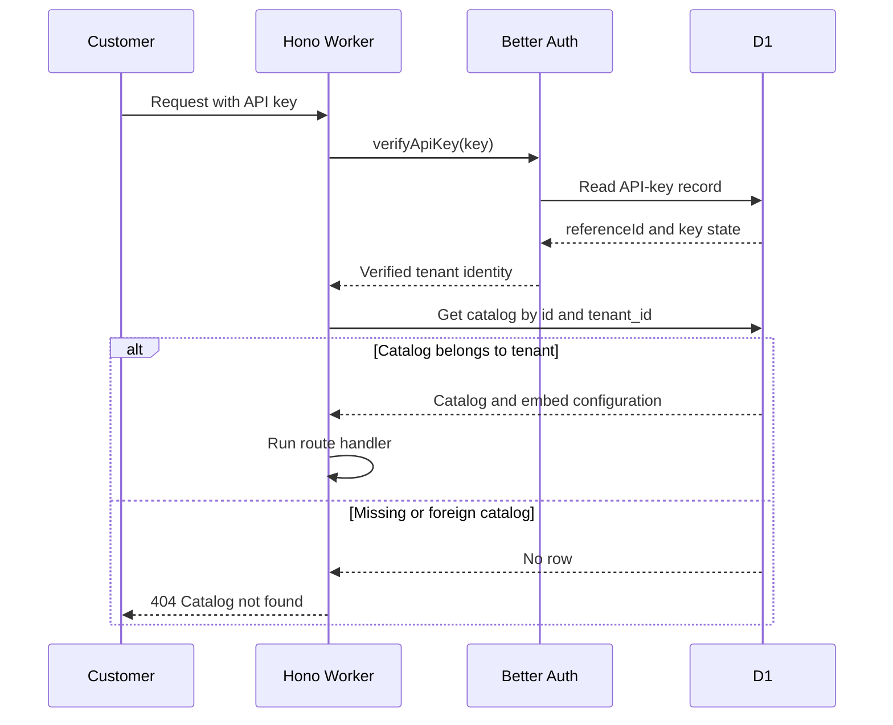
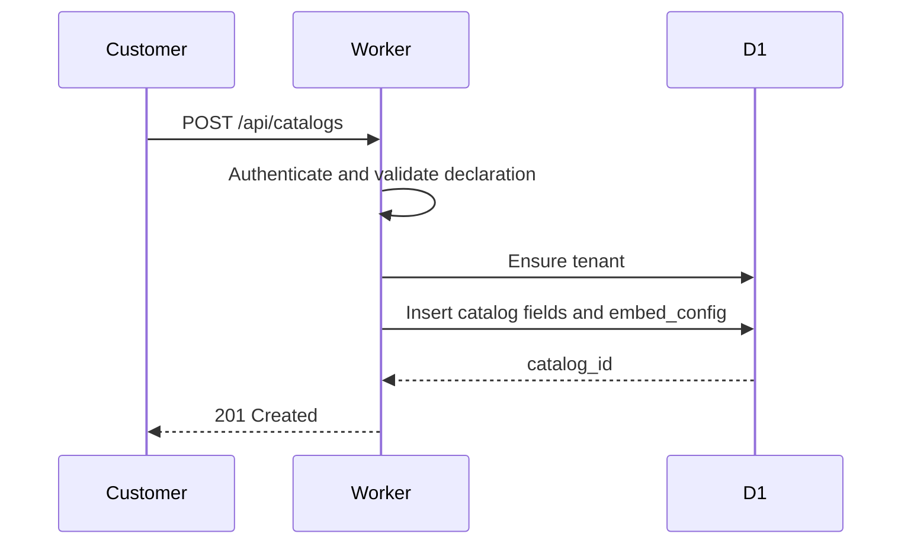
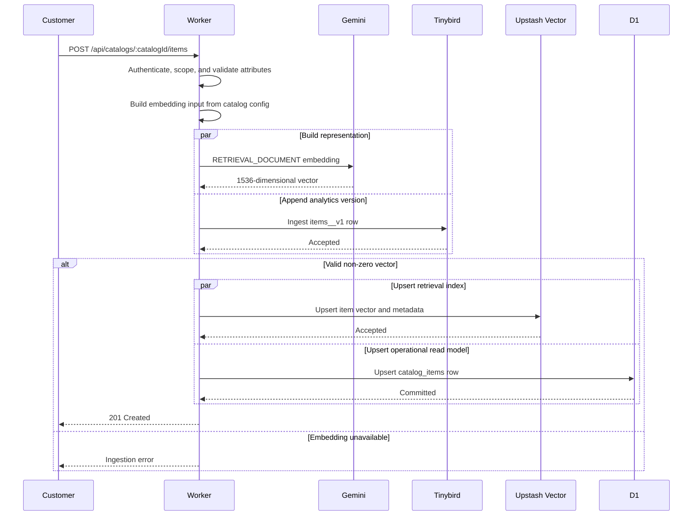
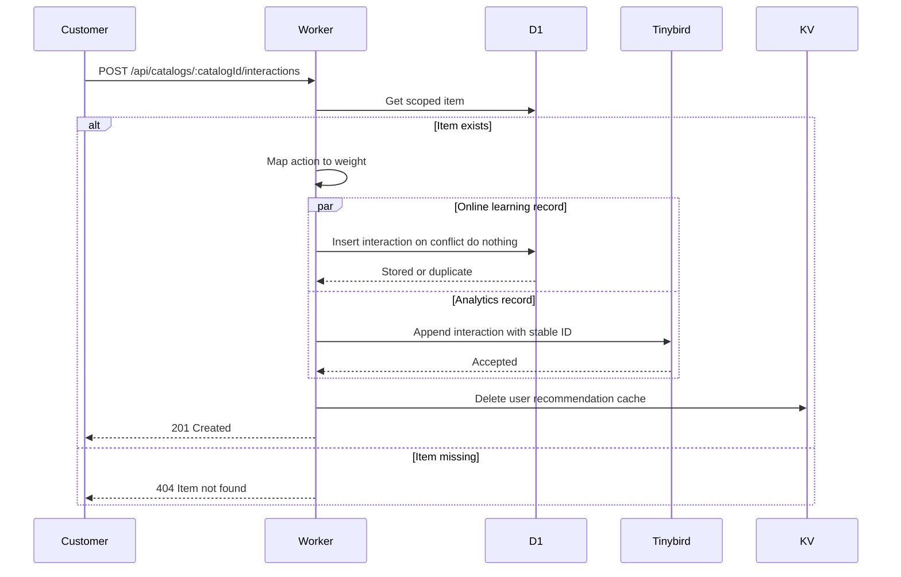
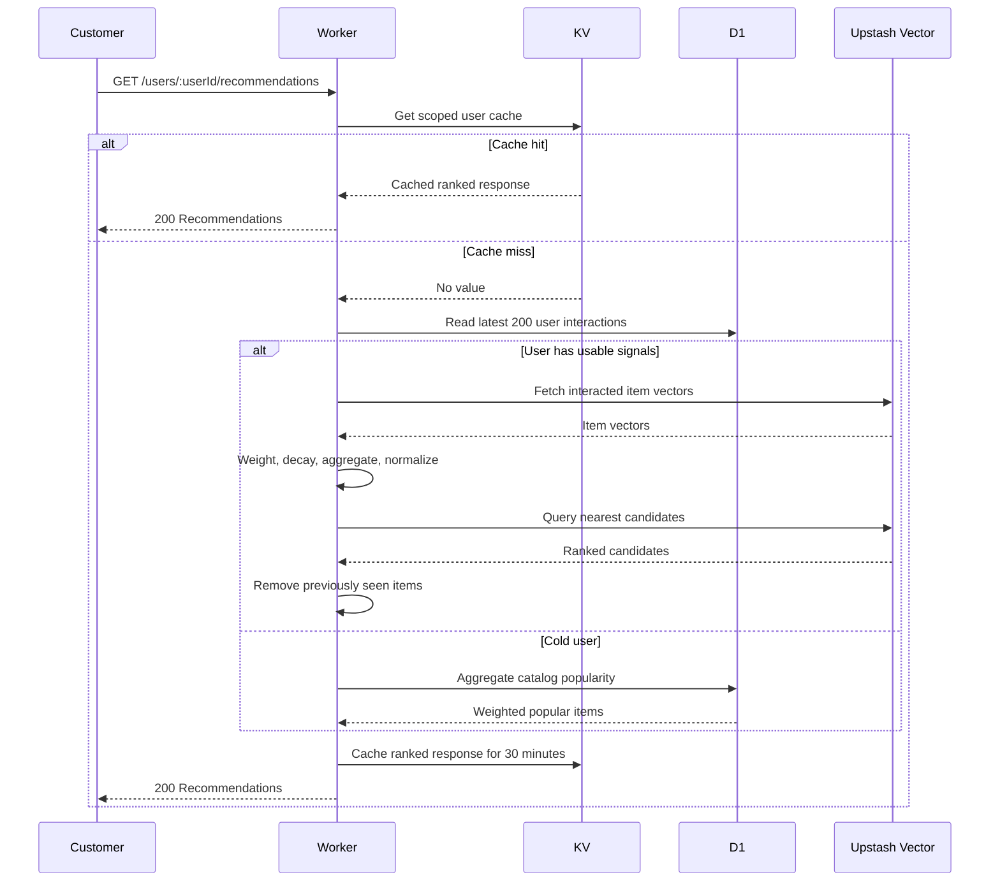
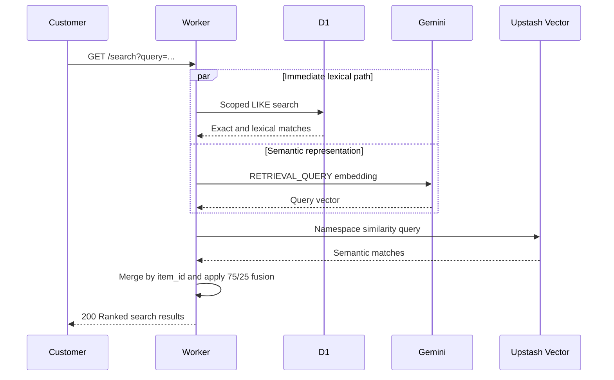
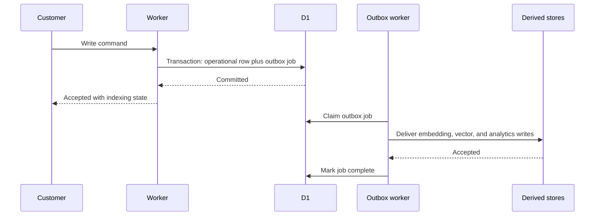

# Lumin Engine request sequences

This file is the sequence-level companion to
[`service-architecture.md`](./service-architecture.md).

## Protected request pipeline

## Register catalog

## Ingest or update item

## Record interaction

## Get recommendations

## Hybrid search

## Failure boundary

The item and interaction write sequences contain parallel writes to independent
systems. They are not distributed transactions. A partial success can occur
before the Worker returns an error.

The intended production evolution is:

